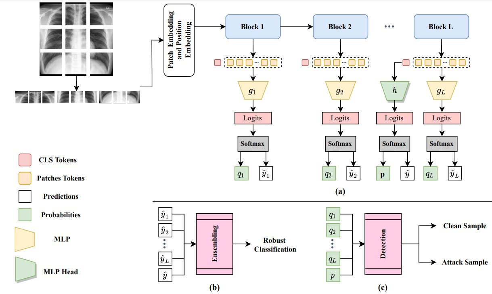

# Self-Ensembling Vision Transformer (SEViT) for Robust Medical Image Classification. 
This repository includes the source code for MICCAI 2022 paper entitled: "Self-Ensembling Vision Transformer (SEViT) for Robust Medical Image Classification."

[](https://arxiv.org/abs/2208.02851)

<hr />




## Abstract 
Vision Transformers (ViT) are competing to replace Convolutional Neural Networks (CNN) for various computer vision tasks in medical imaging such as classification and segmentation. While the vulnerability of CNNs to adversarial attacks is a well-known problem, recent works have shown that ViTs are also susceptible to such attacks
and suffer significant performance degradation under attack. The vulnerability of ViTs to carefully engineered adversarial samples raises serious concerns about their safety in clinical settings. In this paper, we propose a novel self-ensembling method to enhance the robustness of ViT in the presence of adversarial attacks. The proposed Self-Ensembling Vision Transformer (SEViT) leverages the fact that feature representations learned by initial blocks of a ViT are relatively unaffected by adversarial perturbations. Learning multiple classifiers based on these intermediate feature representations and combining these predictions with that of the final ViT classifier can provide robustness against adversarial attacks. Measuring the consistency between the various predictions can also help detect adversarial samples. Experiments on two modalities (chest X-ray and fundoscopy) demonstrate the efficacy of SEViT architecture to defend against various adversarial attacks in the gray-box (attacker has full knowledge of the target model, but not the defense mechanism) setting.

## Download Dataset (Chest X-ray)
[Chest X-ray dataset](https://www.kaggle.com/datasets/tawsifurrahman/tuberculosis-tb-chest-xray-dataset).
[1] includes 7000 images (3500 Normal images and 3500 Tuberculosis images). Download the splitted data from [here](https://drive.google.com/drive/folders/1XmdB37YowEHQTak2rU2iqyzHK8WBF7pO?usp=sharing). 

**Move the downloaded folder to `data` directory**

## Download ViT and Intermediate MLPs
Download the finetuned ViT from [here](https://drive.google.com/file/d/1NulESf8t8Lh7VAOn0nzpURZvYgcUzIaN/view?usp=sharing) and trained MLPs from [here](https://drive.google.com/drive/folders/11nZJuhJhBDqU52EGWU8VFFORoMGtBgiH?usp=sharing). 

**Move the donwloaded files to `models` directory**

## Install dependencies
Run the following command to install dependencies: 

```
pip install -r requirements.txt
```

Also you need to install autoattack library:

```
pip install git+https://github.com/fra31/auto-attack
```
## Test ViT and Intermediate MLPs 
To test the performance of the ViT on the test samples, run the following commmand: 

```
python test.py --model_name ViT --vit_path  [path of the downloaded ViT model]
````

To test the intermediate MLPs performance on the test samples, run the following command: 

```
python test.py --model_name MLPs  --mlp_path  [path to MLP_new_chest folder] --vit_path [path to the downloaded ViT model]
```


## Generate Adversarial Attacks from Test Samples
To generate attacks from clean samples and ViT as a target model, run the the following command: 

```
python generate_attacks.py --epsilons [perturbation size:float] --attack_list [attack #1] [attack #2] --vit_path [path to the downloaded ViT model]  
--attack_images_dir [path to create folder and save attack samples]
```

## Adversarial Robustness (Majority Voting)
In order to evaluate **SEViT** on **Clean samples:** 

```
python majority-voting.py --images_type clean --image_folder_path [path to clean image directory] --vit_path [path to the downloaded ViT model] --mlp_path [path to downloaded MLPs folder]
```

To evaluate **SEViT** performance on **Attack samples:**

```
python majority-voting.py --images_type adversarial --attack_name [attack_name] --image_folder_path [path to root dir of attack images] --vit_path [path to the downloaded ViT model] --mlp_path [path to downloaded MLPs folder]
```

## Adversarial Detection
To perform adversarial detection and save the ROC figure for the generated adversarial samples, run the following command: 

```
python adversarial_detection.py --attack_name [attack_name] --clean_image_folder_path [path to clean images root directory] --attack_image_folder_path [path to root dir of attack images] --vit_path [path to the downloaded ViT model] --mlp_path [path to downloaded MLPs folder]
```

## Citation
```
@inproceedings{almalik2022self,
  title={Self-Ensembling Vision Transformer (SEViT) for Robust Medical Image Classification},
  author={Almalik, Faris and Yaqub, Mohammad and Nandakumar, Karthik},
  booktitle={International Conference on Medical Image Computing and Computer-Assisted Intervention},
  pages={376--386},
  year={2022},
  organization={Springer}
}

```

## Contact
If you have any questions, please create an issue on this repository or contact at faris.almalik@mbzuai.ac.ae.


# References
1. Tawsifur Rahman, Amith Khandakar, Muhammad A. Kadir, Khandaker R. Islam, Khandaker F. Islam, Zaid B. Mahbub, Mohamed Arselene Ayari, Muhammad E. H. Chowdhury. (2020) "Reliable Tuberculosis Detection using Chest X-ray with Deep Learning, Segmentation and Visualization". IEEE Access, Vol. 8, pp 191586 - 191601. DOI. 10.1109/ACCESS.2020.3031384.
